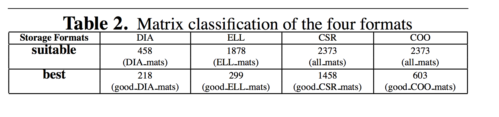
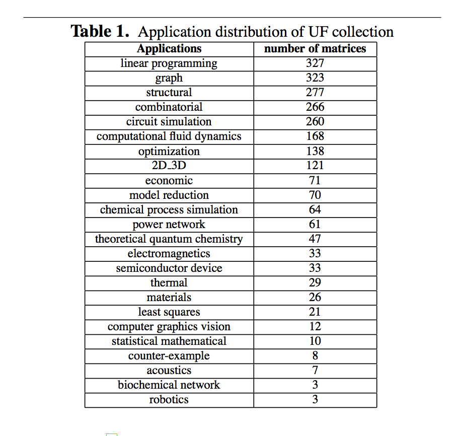
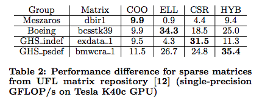
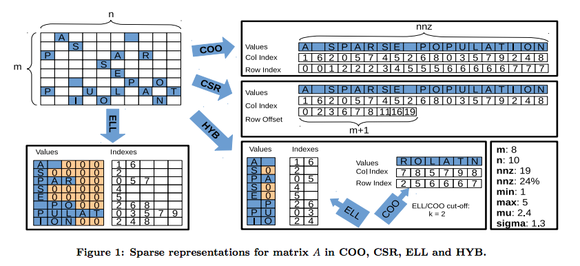
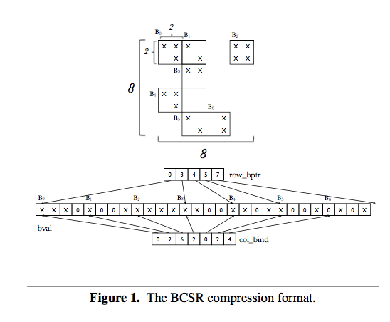
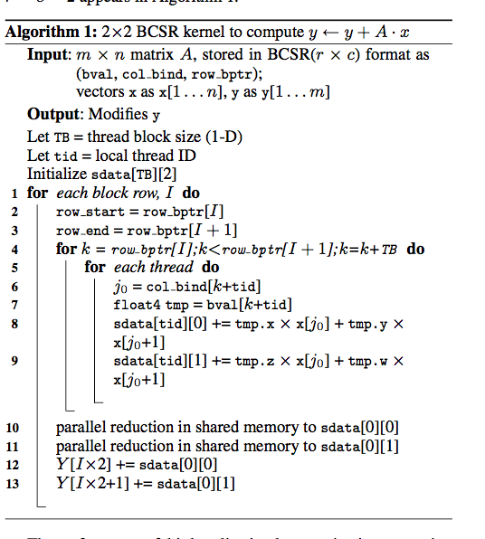
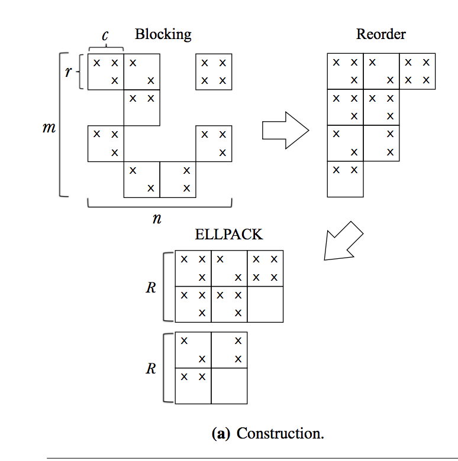

## GPU Project: Sparse Matrix - Vector Multiplication Paper notes

### Thoughts:

Ways to categorize matrices
- Statistics of non-zero rows - mean, mode, std dev
- Sample blocks, count number of non-zero elements, could also calculate statistics of the block e.g. mean, mode, std-dev
- Is the matrix diagonal?
- To check - do the papers which use models to choose the format take into account the conversion time? Can the number of iterations be parameterized? Maybe doesn't need to be since will be captured in total execution time

### Survey

"Any matrix with enough zeros that it pays to take advantage of them"
James Wilkinson

NZ = non zero coefficients
M x N matrix

NZ << M x N

- Problem with the usual factorization methods found in LAPACK etc. is that the normally destroy the sparsity of a matrix by introducing fill-in --> the matrices become unmanageable
-  Sparse Matrix-Vector multiplication (SpMV) is a memory bound problem
- History of its efficient implementation is mostly a story of data structures and of their match to the architecture of the computers employed to run the iterative solver codes
- NVIDIA cuSPARSE library (2015), CUSP (2016)
- Problem arises through mismatch between SIMD GPGPU architecture and the irregular data access patterns of many sparse matrices
- This leads to the development of data structures so that the access patterns are more regular ie. this is a story of storage formats

#### Section 2: Storage formats for sparse matrices
- Standard format for matrix representation: one linear array and two integer values (rows, cols)
- Sparse matrices - need an auxiliary index to avoid storing all of the elements to map between index and location in memory
- Cost of rebuilding the map is THE issue
- Problem: sparse storage means that coefficients stored in adjacent positions in the sparse matrix may operate on vector entries that are quite far apart

" Multiple factors contribute to determine the overall performance
- The match between the data structure and the underlying computing architecture, including the possibility of exploiting special hardware instructions
- The suitability of the data structure to decomposition into independent, load balanced work units
- The amount of overhead due to the explicit storage of indices
- The amount of padding with explicit zeros that may be necessary
- The interaction between the data structure and the distribution of nonzeros (pattern) within the sparse matrix
- The relation between the sparsity pattern and the sequence of memory accesses especially into the x vector"

Formats - three basic, widely used.
1. COOrdinate (COO)
2. Compressed Sparse Rows (CSR)
3. Compressed Sparse Columns (CSC)

1. COO
Requires three arrays. One for storing the non zero elements of the matrix, one for storing the row index, one for the column index
- Five memory reads, one memory write and two floating point ops per non zero coefficient

2. CSR
Requires three arrays. One for storing the non zero elements of the matrix, one for storing the column index, one for marking the boundaries of each row.
- Three memory reads, and two floating point ops per non zero coefficient

3. CSC
V. similar to (2) except  the matrix values are first grouped by column and a row index is stored and column boundaries are marked

More formats
4. ELLPACK?ITPACK - two 2D arrays with M rows and MAXNZR columns (i.e. max number of nonzeros in any row). One array contains the non zero elements, the other the column indices. Rows shorted than MAXNZR are padded with zeros and appropriate column indices
- One memory write per outer op, three memory reads and two FP ops per inner op
- Overhead: memory and redundant ops. Acceptable if the max number of non zeros per row is not much larger than average and the regularity of the data structure allows for faster code.

5. JAD format
- Variant of ELLPACK: sort matrix by number of non zero rows and block

6. DIA
- 2D array containing in each column the coefficients along a diagonal of the matrix, and an integer array offset that determines where each diagonal starts. No indirect addressing required

#### Section 3: GPGPUS

"The main optimization issue to support a GPGPU target then revolves around how an algorithm should be implemented to take advantage of the full throughput of the device. To make good use of the memory access features of the architecture, we need to maximize the regularity of memory accesses to ensure coalesced accesses. In the SpMV context, the ELLPACK format entails a regular access pattern to read the sparse matrix values and the y input vector, provided that we choose a memory layout for arrays ensuring their alignment to the appropriate boundaries in memory. The access pattern is easily exploited by assigning each row of the matrix to one thread; threads in a warp will work on a block of contiguous rows."

Section 4: A survey of sparse matrix formats on GPGPUs

Three main research directions for GPGPUs, not mutually exclusive
1. Applying novel sparse matrix formats, typically derived from classic ones
2. Applying architecture-specific optimizations to existing formats
3. Applying automated performance tuning of the matrix format and
parameters

Auto-tuning methods - determine some parameters to decide on optimal storage scheme
Hybrid approaches are also being explored - i.e. using multiple formats depending on the sparsity pattern

Novel sparse matrix formats:
- COO variants: COO often has bad memory footprint, and can't know in advance which set of coefficients will be used to calculate a single element of the resulting vector
	- ALIGNED_COO (not available)
	- Sliced COO - decomposing matrix into slices based on sparsity patterns (available)
	- Lossless compression of index data (BRO_COO)
	- Blocking ? (BCCOO)
- CSR Variants: problems caused by lack of coalescing, load imbalance, and thread divergence
	- Bell and Garland - explore assigning different number of threads per row to improve memory access patterns
	- Led to work determining optimal number of threads per row based on number of non zero elements per row (e.g. half or full warp)
	- Guo and Gropp - simple auto-tuning: Sort rows in increasing order of nonzero elements per row and partition into several ranges, then assign a given number of threads for different ranges of the matrix rows so as to balance the threads workload.
	- Baxter - two step approach - fast but complex to implement and modify
	- CSR stream  / CSR adaptive
	- Other formats: The Compressed Sparse Row with Segmented Interleave Combination (SIC), Row-grouped CSR (RgCSR) - requires block level sync, BIN-CSR - partitions matrix int bins, bin being a portion of the matrix that is accessed concurrently by a group of threads, and all rows in each bin should have the same length (so shorted rows are padded), Compressed Multi-Row Storage (CMRS), prefetch compressed row storage (PCSR), BCSR - block storage of 2D small dense blocks
-CSC Variants are bad for this, and there is little work on it
- ELLPACK Variants: most effective for GPGPUs. Efficient for matrices with regular or partially regular sparsity patterns ie. with little variation in the number of non zero elements per row.
	- ELLPACK-R: stores number of non zero elements per row to avoid wasted computation of padded zeros (reference implementation)
	- SELL / SELL-C : generalization of ELLPACK-R. Re-order the rows and partition into several slices of similar lengths (slice = set of adjacent rows). Each slice packed into ELLPACK-R format. Slice = 1 --> CSR. Slice = matrix --> ELLPACK
	- Permuting of rows and / or columns to guarantee coalesce memory access
	- SELL-C-sigma - sort rows before slicing
	- BELLPARK - blocked ELLPACK. Sort rows in decreasing number of nonzero elements, then split into blocks - and each block stored in ELLPACK format. May end up with dense blocks. Block size needs to be tuned. Only leads to performance improvements on matrices with small dense block substructures
	- BSELLPACK
	- General problem is the pre-processing required with these algorithms
	- Adaptive ELL - ELLPACK based format. Each warp can process one to multiple rows depending on the sparsity pattern
 - JAD: requires preprocessing the matrix.
	 - ELLPACK-RP has been proposed but only tested on a limited set of matrices
	 - TJAD: significant performance boost for matrices that are neither highly uniform nor highly nonuniform in the number of nonzeros in the rows
-DIA: suitable for matrices with a natural diagonal format. No indirection but can waste storage and computational resources
-Hybrids:
	- COO + ELLPACK: allocates first K nonzero per row to ELLPACK and rest to COO. At least 1/3 of the matrix rows should contain K or more elements
	- CSR + ELLPACK: rows with number of non zero elements > warp size are stored in CSR format, rest in ELLPACK
	- Matam and Khotapalli - CSR + ELLPACK, analyze the sparse matrix structure and choose right data structure to represent it
	- Cocktail Format - Su and Keutzer (2012) - partitions the input sparse matrix into several sub matrices, each with a given format
	- BCOO + BCSR + ELL

Automated tuning and Performance Optimization
- Choi et all 2010 - auto tunes based on matrix dependent params
- SMAT - provide data in CSR format and SMAT automatically determines the optimal storage format and implementation on a given architecture. Use ML
- ML approach using classification trees to select amongst CSR, ELLPACK, COO, and ELL-COO (Sedaghati et al, 2015
- Probabilistic method for selecting target format (Li et al, 2015)

Note: you need to take into account conversion overhead for a format
Assume a matrix provided in COO format

Conversion approaches
Conversion to CSR from an already sorted COO is extremely fast, since it only involves counting the entries in each row and applying a scan primitive to compute the offsets.
- Therefore, CSR conversion is the baseline for device side, since it involves very little time beyond the absolute minimum needed to transfer the coefficient data from host to device memory across the PCI bus.
- Conversion to HYB is implemented by having a CSR format on the host, copying its data to the device, invoking the cuSPARSE conversion to HYB, and then releasing the temporary CSR data.
- For both ELL and HLL, we have implemented the default CPU-side conversion as well as methods split between the CPU and the GPU; the latter are the ones whose times are reported in the tables. Some preprocessing (essentially, counting offsets and maximum row occupancy) is performed on the CPU, and then the coefficients and auxiliary data are copied onto the GPU, where a CUDA kernel uses them to allocate and populate the ELL/HLL data structure.
- The HDI conversion at this time is only implemented on the host; the resulting data structure is then copied on the device side.

See paper for number of iterations required for breakeven point

#### Section 5: Lessons learned

The performance data discussed in this section allow us to state some rules of thumb:
- It is important to consider the conversion overhead: if the matrix (structure) is only used for a few products, it does not pay off to search for sophisticated data structures; CSR suffices. Having the same structure but different coefficients may call for a specialized coefficient update functionality, but the payoff is highly application dependent.
- It is possible to apply a global renumbering of the equations to minimize the matrix bandwidth; this may significantly affect the cache access patterns, but we do not discuss the issue in this article for space reasons.
- Reordering only the rows of the matrix, as necessary in some formats (e.g., JAD), also entails an overhead because we have to reshuffle, at some point, either the output or the input vectors.
- The memory footprint can be a big problem, even for some formats like HLL; however:
- If the matrix comes from a PDE discretization, one should certainly try an ELLPACKlike format first, depending on the memory available, unless:
- If the matrix not only comes from a PDE but also has a piecewise diagonal structure, then HDI is probably a very good idea, and
- If the matrix comes from a graph problem and has a power-law distribution in the number of entries, then the only option among the ones considered here is HYB, but even HYB is not very satisfactory; in this case, it may be appropriate to investigate more specialized formats [Ashari et al. 2014; Yang et al. 2011].

#### Special Section: Utku's Small notes
- It is all about memory and accessing/writing it. We have dense arrays x,y and some representation of the sparse matrix M. We need to retrieve some parts of x for each row and multiply+aggregate sum. We may try to
	- Increase speed
	- Reduce memory footprint (increase coalescing, reduce transactions)
- And we can do that for a specific case or try to be more general. I think, it is better to optimize/work for a specific case and then you can see how well it does for the rest. How many times are you going to repeat the same spMv matter a lot, but if you are doing MtoM multiplication, then you probably going to do many multiplications. It would be nice to check whether sparse MtoM is implemented as many SpMv.
- Didn't really get JAD and DIA, didn't spend time on them
- Hybrids models are better at being general algorithms.
- Results differ considerably between GPU's!!
- I feel like it would be nice to define a use-case for us(pruned networks, network training) and then investigate different methods on them.
- HYB looks cool.

### Parallel Sparse Direct Methods: A short tutorial [evcu]
https://pdfs.semanticscholar.org/bfbe/882ec19e2fae60fdbab805e49569cd292085.pdf
- Linear systems like Ax=b can be solved with doing LU or Cholesky(if A is symmetric) factorization. If A is sparse, LU-factorization would introduce many more non-zeros(fill-in).
- There are four phases and the interesting(bottle-neck) is the numerical factorization. ordering,symmetry, diagonallty matters.
- Dense matrix factorization is O(n^3) and it requires some kind of a parallel execution, since future depends on the past.
- Sparse matrix factorization, in theory requires much less computation and future steps may be taken earlier, whenever sparsity allows that. In other words, there is a dependency graph of work(a DAG) with a root from left-upper corner.
- So the algorithms are focused on load-balancing mainly.
- You first need to generate the graph and that is the important part since, you can generate different dependency graphs from the same Linear system by doing reordering. `nested dissection` algorithm is the best known heuristic.
- Using supernodes(rows or columns with the same nonzero structure) would reduce the ordering calculations.

### A lightweight optimization selection method for Sparse Matrix-Vector Multiplication, Jan 2016
https://arxiv.org/pdf/1511.02494.pdf

- Two approaches to selecting optimization
1. Based on online profiling of performance
2. Structural features of the sparse matrix

Applications
- Iterative methods for the solution of sparse linear systems
- Approximation of eigenvalues and eigenvectors of sparse matrices

Desirable characteristics for optimization methodology
- stable: should yield improvements on all sparse matrices
- cross-platform
- lightweight: run time overhead of optimization selection should be low

- Frame problem as a classification task where classes = performance bottlenecks
	- Online or offline/ml classifiers
- Tested on Intel Sandy Bridge and Intel Xeon Phi (sort of GPU)

Problem with CSR\
- Indirect memory references
- Irregular memory accesses to the vector x
- short row lengths

Classes
- CML: This class refers to matrices that suffer from excessive LLC misses and can therefore be bound by cache miss latencies.
- MB: This class includes matrices that have saturated the available memory bandwidth.
- IMB: This class appears mostly on many-core architectures, where the large number of threads exposes highly uneven row lengths in the matrix or regions with completely different sparsity patterns, resulting either in workload imbalance or computational unevenness.
- CMP: This class includes matrices that are bound by computation. Such matrices are mostly matrices that fit in the system’s caches and are, therefore, not limited by main memory bandwidth.

- "Blind ML" approach not necessary according to the authors
- Alternative approaches to defining classes - clustering

**Profiling based classifier**
- Profile matrix using three benchmarks (modified CSR) - noxmiss, inflate, balance

**ML based classifier**
- Decision tree and naive bayes (using scikit learn)
- features
	- size
	- density (number non zero / total elements)
	- number non zero - max, min, avg, sd
	- column distance between first and last non zero elements of row i - max, min, avg, sd
	- dispersion (?) avg, sd
	- Clustering: number of groups (group = consective non zero elements in a row) / number of non zero elements in a row
	- miss ratio: number of non zero elements in row i that can generate cache misses (e.g. distance from previous element in the same row > cache line size of the system)

	**Optimizations**
	Note: Only CSR based optimizations
	- CML: software prefetching on vector x
	- MB: column index compression through delta coding
	- IMB: auto or dynamic scheduling (OpenMP)
	- CMP: inner loop unrolling + vectorization

	- Some issues with optimization: model may be selecting the right class but the optimization is not as effective (measure of success is not accuracy but performance improvement).
	- Need to compare selected speedup to ideal speedup (i.e. run each matrix with all of the optimizations)

	**Measuring run time overhead**
	- Time to classify / Time to execute the SpMV kernel
	- Note: The kernels appear pre-written, so there is no cost to re-formatting

- Related work:
	- clSpMV framework. This approach is restricted to GPUs.
	- A performance modeling and optimization analysis tool for sparse matrix-vector multiplication on gpus, Guo et al: They have an analytical and profile-based performance model to predict the *execution time* of SpMV on GPUs using different sparse matrix storage formats
		- Features: just number of non zero elements per row (to check)
- Can also use storage format selection as the class (e.g. SMAT)

### Accelerating Sparse Matrix Vector Multiplication in Iterative Methods Using GPU
http://ieeexplore.ieee.org/document/6047229/
-TO READ:  Contains some work analyzing sparse matrix structure
- Utku

### SMAT: An input adaptive auto-tuner for sparse matrix-vector
I'm not impressed by the ML, which is just decision trees based 'if-else'
https://arxiv.org/abs/1210.2536
- In one point, given CSR format they get some basic features(they count all the way(no sampling), like 7-8) and they use 4 binary classifier to choose from DIA,ELL,CSR,COO in-order (first use DIA classifier with DIA specific features whether it is a good fit for DIA or not, then ELL etc.). After choosing the best representation they use the provided libraries.
- Their motivation is the gap between specific research with various formats and the practice. They are attacking this gap by providing CSR based wrapper, which amortizes itself around 20 iterations.
- They have selected 2373 matrices from UF-sM collection and they benchmark the best known-or-(probably)available algorithms for each of the four representation.

- They didn't include hybrid-model, which is much more balanced solution and I guess it would give a similar result as their 'ML' solution. 

###  A model-driven blocking strategy for load balanced sparse matrix-vector multiplication on GPUs, Sedaghati et al, 2015
https://ac.els-cdn.com/S0743731514002081/1-s2.0-S0743731514002081-main.pdf?_tid=1a8fcc74-bdd2-11e7-9796-00000aacb35d&acdnat=1509409754_e68b4a6351498b88c6b95658a7dbe1cb
- TO READ:  ML approach using classification trees to select amongst CSR, ELLPACK, COO, and ELL-COO
- Utku

### Automatic selection of sparse matrix representation on GPUs,  Sedaghati et al, 2015
http://web.cse.ohio-state.edu/~pouchet.2/doc/ics-article.15b.pdf

Focuses on four SpMV representations implemented in cuSPARSE and CUSP:
- CSR
- ELLPACK
- COO
- ELL-COO (HYB)

- Gathered 682 matrices from the [UFL repository](https://sparse.tamu.edu/about)
	- Matrices were selected with 3 constraints
		1. C1: the sparse matrix does not fit in the CPU LLC (8 MB for our machines). This is to focus on matrices where GPU execution is most beneficial.
		2. C2: the sparse matrix fits in the “effective” space on the global memory of the device (i.e. single-GPU execution).
		3. C3: the number of rows is large enough to guarantee minimum GPU concurrency. This is achieved by assuming that a warp works on a row; thus the minimum number of rows equals the maximum warp-level concurrency on a given device.
- Used decision trees to classify matrices

- Work does not take into account the conversion time
	- Possible extensions it to model conversion time and number of expected iterations

**Feature set**
- Similar to the lightweight optimization paper
- Additional features: Number of non zero blocks per row, size of non zero blocks per row

### Graph Clustering survey
http://www.leonidzhukov.net/hse/2015/networks/papers/GraphClustering_Schaeffer07.pdf
- MAYBE TO READ
- Utku?

### Model-driven autotuning of sparse matrix-vector multiply on GPUs
https://dl.acm.org/citation.cfm?id=1693471
- Focus on tuning blocked implementations like BCSR and BELLPACK. They need to carefully(brute-force) tune the parameters to come-up with optimal speed-up. They propose a model for guessing those parameters, which may provide 15% less performance.
- Their BELLPACK uses explicit storage to compress data and reordering of rows.
- Their approach is limited to the sparse matrices with small amount of dense rows. If your rows are evenly distributed, you don't need blocked architecture anyway.

- **Optimizations**
	- **Short Vector Packing**: Packed the blocks into vectors of *float2* *float4* . *float4* is good since it automatically aligns the memory. So pad with 0's if you have something like 1*3 blocks.
	- **Row Alignment**: Pad blocks with zeros whenever the total size is smaller then the word-size

- Exp. results for BCSR is better then CSR worst then the NVIDIA's hybrid. Parallel reduction is the reason they say.
- Their BELLPACK implementation is interesting. They are first picking the block size r*c and create the matrix of blocks. They are attacking the uneven distribution problem of ELLPACK by sorting the rows by #blocks and separating them in to R bins. Each of the bins get its own ELLPACK representation. So They need to carefully adjust r,c and R. Their results are better then hybrid strategy of NVIDIA.

- They try to model different GPU's with their specs. They define the formula for max thread blocks per MP, which basically depends on three ideas, registers, shared memory and hardware limits(max warp, max thread, max thread-block etc.)
- They are trying to estimate some parameters in their definitions like the latency, per occupancy factor. They are using previous benchmarks to come-up with an execution-time-model.
- You can sample the matrix(like 1%) to come-up with non-zero% and total size.
